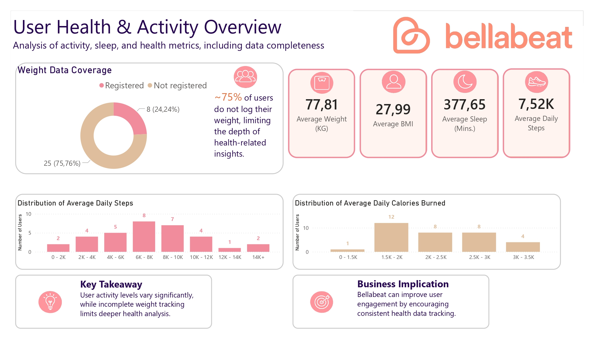
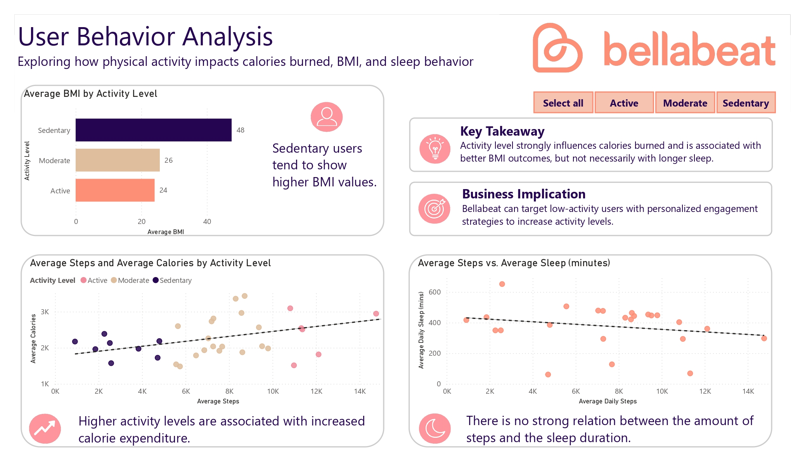
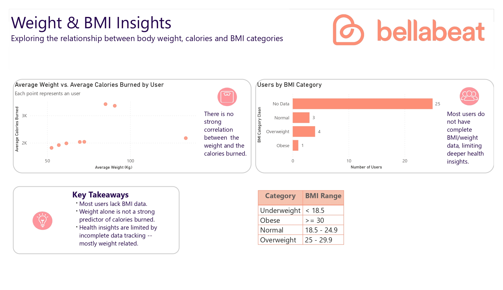

# 📊 Fitbit User Behavior & Health Analysis

## 📌 Overview
This project analyzes user activity (steps), sleep, and health data from Fitbit devices to identify behavioral patterns and generate business insights for Bellabeat, a women wellness-focused company.

---

## 🎯 Business Objective
- Understand trends in smart device usage
- Identify relationships between activity, sleep, and health metrics
- Provide data-driven recommendations for Bellabeat’s marketing strategy

---

## 🧠 Key Insights
- ~75% of users do not log their weight, limiting health analysis
- Higher activity levels are associated with increased calorie expenditure
- No strong correlation between activity and sleep duration
- Sedentary users tend to have higher BMI

---

## 💡 Business Recommendations
- Encourage consistent health data tracking through app engagement
- Target low-activity users with personalized campaigns

---

## 🛠️ Tools & Technologies
- SQL (data cleaning, modeling, views, transformations)
- Power BI (dashboard & data visualization)
- Google Sheets (data validation)

---
## 🔧 Data Preparation (SQL)
Data cleaning and transformation were performed using SQL. The process included:

- Converting data types (VARCHAR → DECIMAL, DATE, DATETIME)  
- Standardizing date formats across tables  
- Handling missing values and inconsistent entries  
- Creating a structured relational model with primary and foreign keys  

### Example:
```
sql
UPDATE daily_activity
SET TotalDistance = ROUND(CAST(TotalDistance AS DECIMAL(10,5)), 2);
```
---

## 🧱 Data Modeling

To ensure data integrity and scalability:

- Composite primary key used for daily_activity
- Surrogate keys implemented for sleep_day and weight_log_info
- Foreign keys used to connect all tables to the users table

---

## 📊 Data Transformation

Analytical views were created to prepare the dataset for visualization:

- User-level aggregations (steps, calories, sleep, weight, BMI)
- Activity level classification (Sedentary, Moderate, Active)
- BMI categorization (Underweight, Normal, Overweight, Obese)

---

## 📊 Dashboard Preview

### Overview


### Behavior Analysis


### Health Insights


---
## 📎 Dataset
Full dataset available on Kaggle:
[https://www.kaggle.com/datasets/arashnic/fitbit](https://www.kaggle.com/datasets/arashnic/fitbit)
